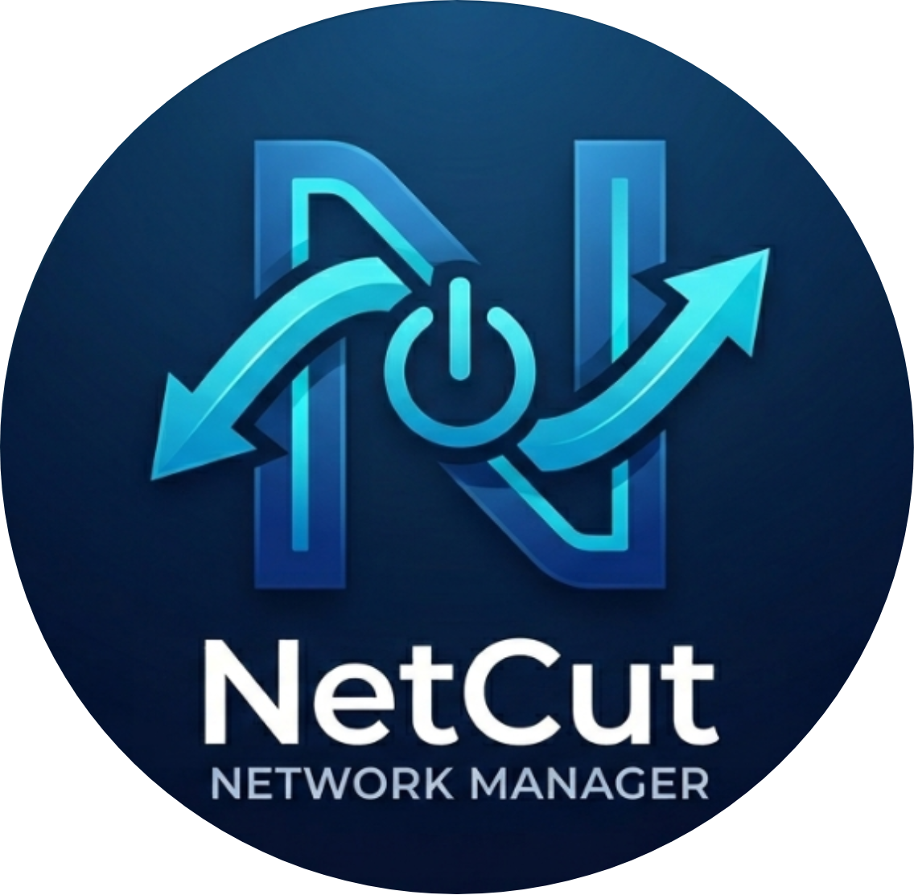

# 🛠️ Utility Repo

### 📌. Anchor 
* [S7 Bi-directional Simulation Bridge](#s7-bridge)
* [ASCII CONVERTER](#ascii-converter)
* [EasyShare Fixer](#EasyShare-Fixer)
* [Socket-Porter](SocketPorter)
* [Net-Cut](Net-Cut)

 
 

 
 

  
  <h3>S7 Bi-directional Simulation Bridge</h3>
  
S7-300과 S7-400 간의 양방향 데이터 시뮬레이션을 지원하는 브리지 도구입니다.

  
A bridge tool that supports two-way data simulation between S7-300 and S7-400.

   
  

 
 

 
 

  
  <h3>ASCII CONVERTER</h3>
  
문자열을 사용자 선택에 따른 특정 ASCII 코드로 변환하는 도구입니다.

  
A tool that converts strings into specific ASCII codes based on user selection.

   
  

 
 

 
 

  
  <h3>EasyShare Fixer</h3>
  
Windows 10/11 운영체제에서 네트워크 공유 폴더 접속 문제를 클릭 한 번으로 해결하는 자동화 도구입니다.

  
An automated tool that solves network shared folder access issues in Windows 10/11 OS with one click.

   
  

 
 

 
 

  
  <h3>SocketPorter</h3>
  
쉽고 안전하게 파일을 공유할 수 있게 해주는 직관적인 네트워크 파일 전송 도구입니다.

  
An intuitive network file transfer tool that lets you share files easily and securely.

   
  

 
 

 
 

  
  <h3>Net-Cut</h3>
  
A network management tool that instantly blocks unnecessary network adapters or disables all of them, leaving only the desired connections.

  

   
  

 
 
